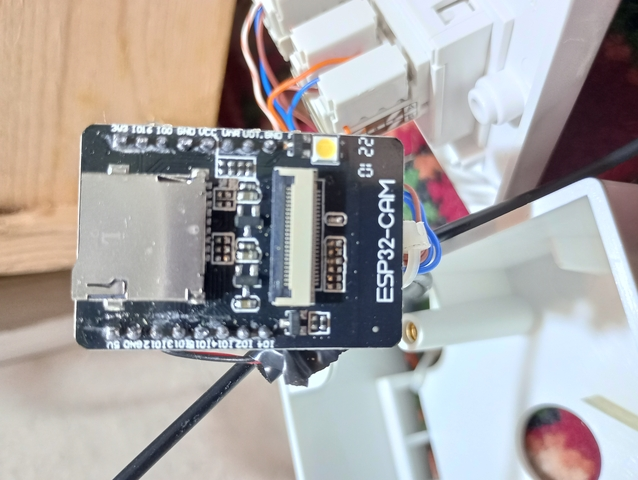
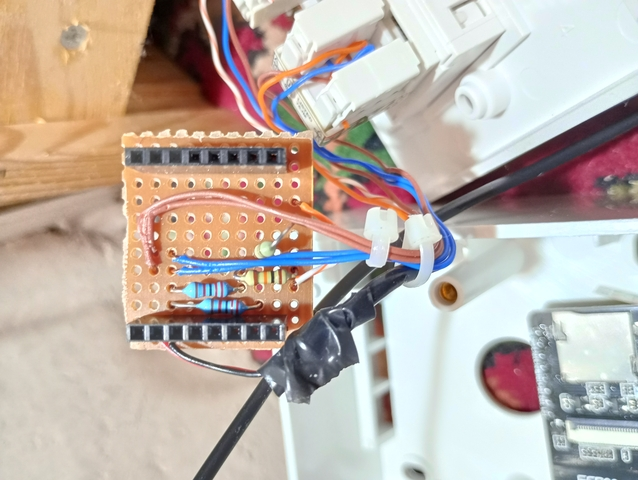
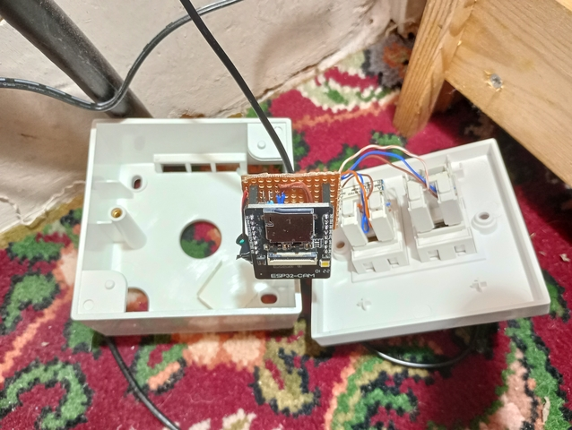
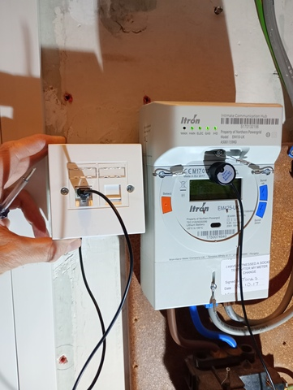

# Electricity Usage Monitor

# Hardware

  - ESP32 Cam board (without the camera installed) - I just used this because I had a few of the boards - I am only using it as a WiFi enabled microcontroller.
  - [Open Energy Monitor LED Pulse Sensor](https://shop.openenergymonitor.com/optical-utility-meter-led-pulse-sensor/).
  
  The LED pulse sensor provides TTL (5V) logic signals, so it is connected to the ESP32 board via a potential divider (7k6 and 22k0 resistors) to drop the voltage to something compatible with the 3.3V logic on the ESP32.   The sensor is connected to Pin 14 of the ESP32 Cam board, with a second (unused) input on Pin 02.

  The potential dividers are wired on a small board with header sockets attached to the ESP32Cam board as shown in the images below, and connected to the pulse sensor via an RJ45 socket.

# Firmware
It uses the EspHome firmware, configured using [powermeter.yaml](powermeter.yaml).

Copy [secrets.yaml.template](secrets.yaml.template) to secrets.yaml, and modify for your network settings.

It can then be built using 'esphome compile powermeter.yaml'

# Images

