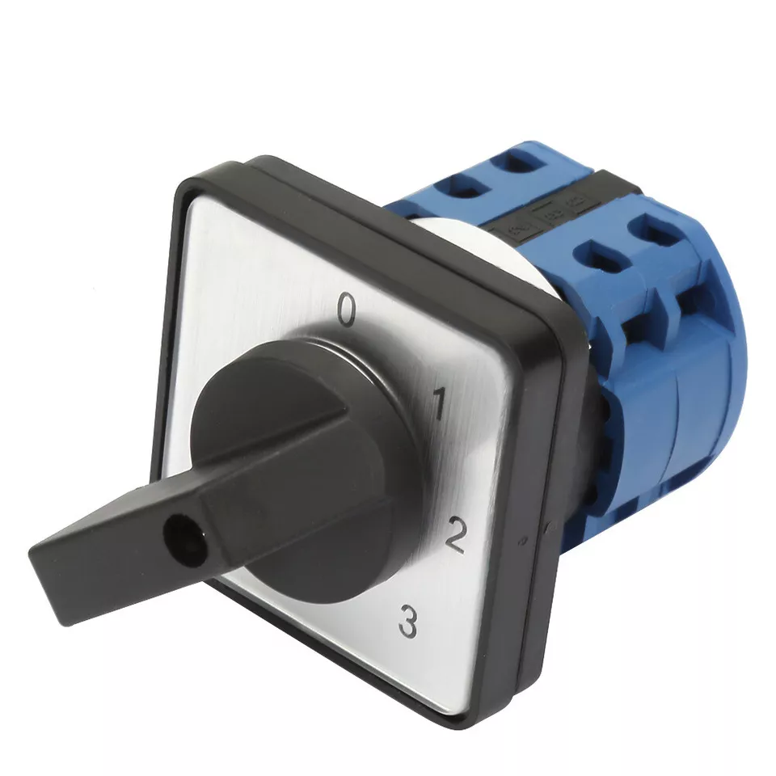

# Heating Controller

## System Overview 

There are three main parts to the central heating control unit:
  - A Control Panel which:
    - has physical switches to select each of the four heating zones to be off, thermostat controlled, computer controlled or on.  This is so we can override the computer control if it is not working correctly!  
    - has LED indicators to show the actual status of each zone.   
    - provides 240V AC signals to the zone valves via a separate junction box.
    - takes the switched 240V AC signal from the zone valves to switch the boiler demand contacts via a relay.
  - A 4 channel ESP32 based relay board which provides the computer control functionality vi MQTT messages (see below for details)
  - An ESP32 based boiler monitor which measures central heating and hot water temperatures and provides these to the server via MQTT messages (it is intened to merge this functionality into the relay board later to reduce the number of microcontrollers in use).

## Control Panel
  - The control panel is based around a large junction box from [Screwfix](https://www.screwfix.com/p/british-general-ip55-weatherproof-outdoor-enclosure-270mm-x-180mm-x-135mm/86625).
  - It has four large four position selector switches from [Ebay](https://www.ebay.co.uk/itm/386674176742)
  - Uses LED based mains indicators from [Amazon](https://www.amazon.co.uk/dp/B09PFMY6YQ?ref=ppx_yo2ov_dt_b_fed_asin_title&th=1)
  - The mains on/off switch is from [Amazon](https://www.amazon.co.uk/dp/B07T2RMYVW?ref=ppx_yo2ov_dt_b_fed_asin_title)
  - The connections within the enclosure are via a DIN rail populated with 'Wago-Like' lever connectors from [Amazon](https://www.amazon.co.uk/DIN-Terminal-Blocks-Aigreat-Connectors/dp/B0BGPVGKGZ?pd_rd_w=LCUWm&content-id=amzn1.sym.a34fb0f3-9916-4f90-85ff-bea3e23caef2&pf_rd_p=a34fb0f3-9916-4f90-85ff-bea3e23caef2&pf_rd_r=RNNKJKY9K92BZF4YSNE1&pd_rd_wg=3OtRd&pd_rd_r=6dca1504-92f2-4676-8a3c-2be763f6525c&ref_=pd_bap_d_csi_rtpb_bap_sim_0_pr_t&th=1)

## Relay Board
  - The 4 channel, ESP32 based relay board was from [Amazon](https://www.amazon.co.uk/dp/B0CJ5CZ4XR?ref=ppx_yo2ov_dt_b_fed_asin_title)
  - It is programmed using firmware produced by EspHome - the initial programming was via a usb to serial adapter connected to the header on the board.  Subsequent reprogramming can be via Over The Air (OTA) programming by EspHome.
  - In the [Firmware](Firmware) folder you can execute 'esphome run boiler_controller.yaml' to compile and upload it (after copying secrets.yaml.template to secrets.yaml and customising it for your network settings).

## Images

### Control Switch

