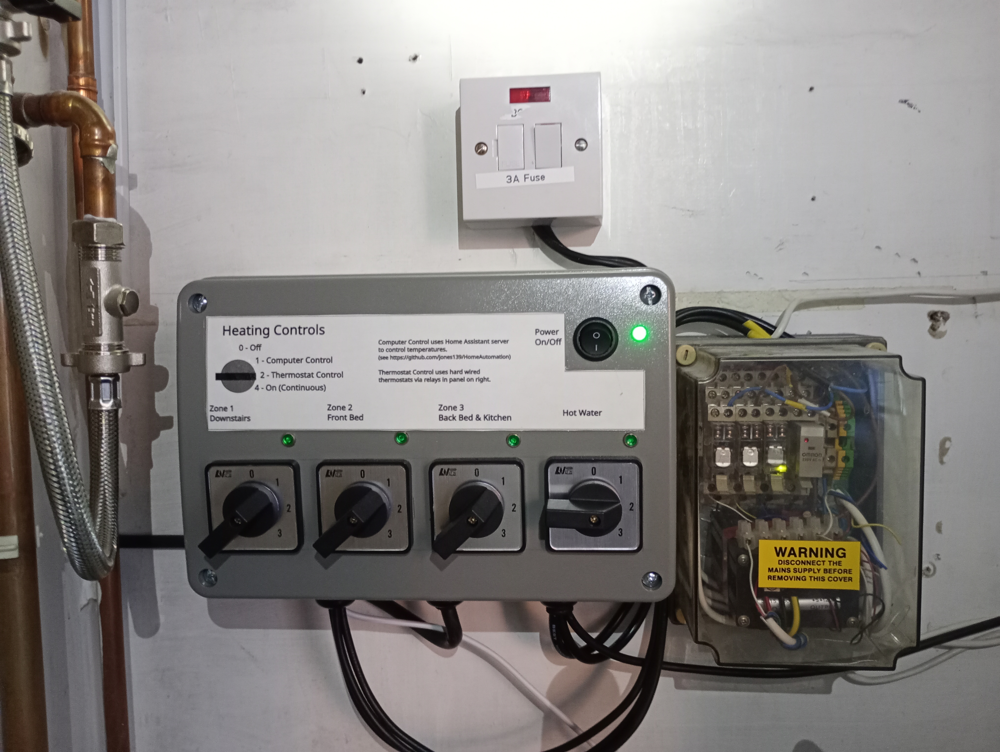
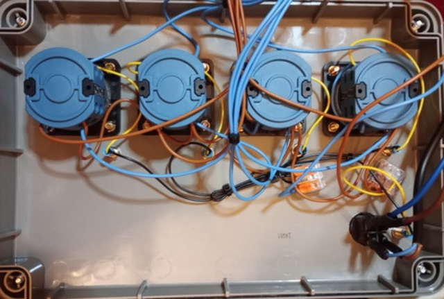

# Heating Controller

## System Overview 

There are three main parts to the central heating control unit:
  - A Control Panel which:
    - has physical switches to select each of the four heating zones to be off, thermostat controlled, computer controlled or on.  This is so we can override the computer control if it is not working correctly!  
    - has LED indicators to show the actual status of each zone.   
    - provides 240V AC signals to the zone valves via a separate junction box.
    - takes the switched 240V AC signal from the zone valves to switch the boiler demand contacts via a relay.
  - A 4 channel ESP32 based relay board which provides the computer control functionality vi MQTT messages (see below for details)
  - An ESP32 based boiler monitor which measures central heating and hot water temperatures and provides these to the server via MQTT messages (it is intened to merge this functionality into the relay board later to reduce the number of microcontrollers in use).

Note that the hot water zone is wired differently to the heating zones - thermostat control utilises the cyliner stat at 240V so there is no need for an interposing relay for thermostat control.   Also the computer control mode does not control the cylinder heating directly, instead the computer controlled relay provides the ability to inhibit hot water heating via the cylinder stat.   This is because the DS18B20 temperature sensor fitted to the cylinder and monitored via the ESP32 board in the control panel has proved to be unreliable so not suitable for a control function at the moment.

The schematic for the wiring of the switches and relay board is provided below.

## Control Panel

  - The control panel is based around a large junction box from [Screwfix](https://www.screwfix.com/p/british-general-ip55-weatherproof-outdoor-enclosure-270mm-x-180mm-x-135mm/86625).   
  - It has four large four position selector switches from [Ebay](https://www.ebay.co.uk/itm/386674176742)
  - Uses LED based mains indicators from [Amazon](https://www.amazon.co.uk/dp/B09PFMY6YQ?ref=ppx_yo2ov_dt_b_fed_asin_title&th=1)
  - The mains on/off switch is from [Amazon](https://www.amazon.co.uk/dp/B07T2RMYVW?ref=ppx_yo2ov_dt_b_fed_asin_title)
  - The connections within the enclosure are via a DIN rail populated with 'Wago-Like' lever connectors from [Amazon](https://www.amazon.co.uk/DIN-Terminal-Blocks-Aigreat-Connectors/dp/B0BGPVGKGZ?pd_rd_w=LCUWm&content-id=amzn1.sym.a34fb0f3-9916-4f90-85ff-bea3e23caef2&pf_rd_p=a34fb0f3-9916-4f90-85ff-bea3e23caef2&pf_rd_r=RNNKJKY9K92BZF4YSNE1&pd_rd_wg=3OtRd&pd_rd_r=6dca1504-92f2-4676-8a3c-2be763f6525c&ref_=pd_bap_d_csi_rtpb_bap_sim_0_pr_t&th=1)

## Relay Board
  - The 4 channel, ESP32 based relay board was from [Amazon](https://www.amazon.co.uk/dp/B0CJ5CZ4XR?ref=ppx_yo2ov_dt_b_fed_asin_title).  
  - This board was selected because it can be powered directly from 240V AC so does not require a separate power supply - but there are many similar devices available which will work the same.
  - It is programmed using firmware produced by EspHome - the initial programming was via a usb to serial adapter connected to the header on the board (see Image below).  Subsequent reprogramming can be via Over The Air (OTA) programming by EspHome.
  - In the [Firmware](Firmware) folder you can execute 'esphome run boiler_controller.yaml' to compile and upload it (after copying secrets.yaml.template to secrets.yaml and customising it for your network settings).

## Boiler Monitor
  - The relay board described above is also used for monitoring temperatures around the boiler system.
  - I am using a string of Dallas DS18B20 digital thermometers to monitor the water temperatures in the various zones of our heating system.
  - Initially I had wired it to connect to the nearest GPIO pin to the 3.3V and GND connectors.   This was GPIO34.   Unfortunately I discovered that this pin only works in input mode (see the [pinout](https://mischianti.org/esp32-wroom-32-esp32-s-flash-pinout-specs-and-ide-configuration-1/)) for the ESP32 chip on the relay board.
  - It looks like G27 is the nearest available GPIO pin (because 32, 33, 25 and 26 are used for the relay control - so I used a bigger header connector and G27, along with integral 4k7 resistor as shown below.)
  
  - I have had issues with the reliability of the DS18B20 string - they work fine for a while but then stop updating.  I am not sure if this is because of electrical noise from all the mains wiring in the control panel, or if it is a faulty sensor hanging the 1 wire bus.   For the time being I have cut the string of sensors and am only running one on the hot water cylinder to monitor cylinder temperature and to see how long it runs.

## Images

### Wiring Schematic

Click on the image for a higher resolution PDF of the schematic, or refer to the [kicad source](./Schematic/Central_Heating_Controls.kicad_sch).

### Control Switch

### Control Panel Front with the thermostat relay panel

Our original central heating control system utilised hard wired room thermostats that use 12V DC for control.  The zone valves need 240V AC, so we have a panel containing interposing relays to switch the 240V signal in response to the 12V signals from the thermostats.

### Control Panel Rear

### Internal Wiring

### Zone Valves
The zone valves are all in the bottom of the heating cupboard with isolation valves either side so we can replace them easily when one fails.
A simple Honeywell junction box is used to connect the zone valves to a multi-core cable which leads to the main control panel.

