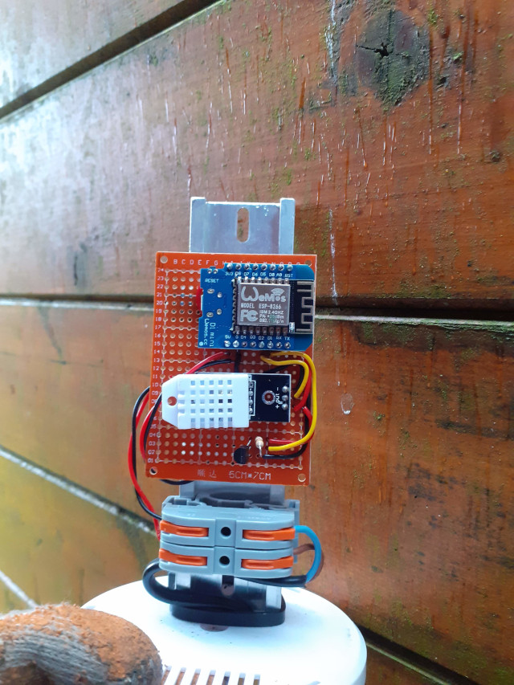

Weather Station
===============

## Hardware

  - Wemos D1 Mini ESP8266 development board.
  - Dallas Semiconductors DS18B20 temperature sensor connected to Pin D1 (GPIO5) (with 4k7 pull up resistor to 3.3V line)
  - DHT22 module (which has built-in pullup so no external resistor required), connected to Pin D2 (GPIO4).

These are powered using a 5V power supply conneced directly to the 5V pin of the Wemos D1 mini board (we do not use the micro-usb connector for power because it does not fit through the hole in the thermometer screen).

## Software

  - Copy credentials.h.template to credentials.h, and update to match your configuration.
  - WeatherStation.ino should build and flash onto the ESP8266
  - It reads the temperature from the DS18B20 sensor and humidity from the DHT22 once per minute and uploads it to Thingspeak

## Things to Do

  - Update software to upload data to the Greenhouse server (or provide a web service to provide the data on demand).
  - Update software to upload to a weather service (openweathermap?)
  - Add a rain gauge
  - Add a light sensor.
